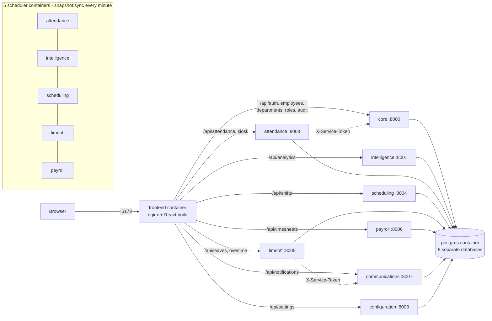

# DOCKER GUIDE FOR DEEPSEEK — How Docker works in the Workforce Management System

> **Read this together with `DOCX UPDATE GUIDE FOR DEEPSEEK.md`.** That guide explains how to update the
> capstone document (Chapters 1–3, appendices) to match the system. **This guide is an addition.**
> Docker was added to the system after that guide was written. Wherever the two disagree about Docker,
> **this guide wins** (Part 9 lists exactly which statements it replaces).
>
> Every fact below was **built and tested on the real system** (Part 8 lists the tests and their results).
> Do not add Docker features that are not written here. If something is not in this file, it does not exist.

---

## 0. How to use this file (for the human)

1. Send DeepSeek **both** guide files plus the text of the docx chapter you are fixing (one chapter at a time).
2. Ask: *"Using DOCKER GUIDE FOR DEEPSEEK.md, rewrite every part of this chapter that mentions Docker,
   containers, deployment, tools, architecture or how the system is run. Follow Part 9 and Part 10."*
3. The Docker work is on a git branch called `docker` and is **not yet merged into `main`** (see Part 11, decision D-1).
   Make sure it is merged before the defense so the repository matches the document.
4. **Never paste the `.env` file or any password/token into DeepSeek.** This guide contains none.

---

## 1. Rules for DeepSeek

1. **Do not invent.** Only use facts from this file. If you need a fact that is not here, write `[NEED FROM TEAM: …]`.
2. **Keep it honest.** Docker here is a *development / demonstration* setup. Do **not** call it production-ready,
   cloud-deployed, Kubernetes, load-balanced, auto-scaled, or "CI/CD". Part 7 lists what must never be claimed.
3. **Keep the document's existing style**: APA citations, numbering, tense, headings. Do not touch the literature review or references.
4. **Return ready-to-paste text**, marked `ORIGINAL:` and `REPLACEMENT:` for each changed paragraph, plus a short list of anything the team must decide.
5. **Terminology:** say **Docker** and **Docker Compose**; say **container** and **image**; call the routing component **"nginx reverse proxy in the frontend container"**, *never* "API gateway".

---

## 2. What Docker is here, in one paragraph (use this wording style)

The Workforce Management System is made of **8 independent Laravel microservices**, a **React frontend** and a
**PostgreSQL** server. Before Docker, a developer had to install PHP, Composer, Node and PostgreSQL by hand and start
each part with a PowerShell script (`start-all.ps1`). Docker packages **every part into its own container** (a sealed,
self-contained box with everything that part needs), and **Docker Compose** starts all of them together with one command.
The system's **features and business rules did not change** (a few small bug fixes made while testing are listed in Part 6); Docker only changes **how the system is built, started and isolated**.

---

## 3. The Docker setup — ground truth

### 3.1 Files added (all in the project root)

| File | Purpose |
|---|---|
| `docker-compose.yml` | Defines all 15 containers, their ports, environment, start order and health checks |
| `docker/backend.Dockerfile` | One recipe used to build **each of the 8 Laravel service images** (a build argument picks the service) |
| `docker/frontend.Dockerfile` | Two-stage recipe: builds the React app with Node, then serves it with nginx |
| `docker/nginx.conf` | nginx settings: serves the React app and routes each `/api/...` prefix to the right service |
| `docker/backend-entrypoint.sh` | Runs before each API container: applies database migrations (and seeds the admin in core) |
| `docker/postgres-init/01-create-databases.sh` | Creates the 8 databases the first time the PostgreSQL volume is created |
| `.dockerignore` | Keeps secrets, `vendor`, `node_modules`, docs and `.env` files out of the images |
| `.env.docker.example` | Template for the secrets file. The real `.env` is **git-ignored** |
| `.gitattributes` | Forces Linux line endings on shell scripts so they run inside containers |

### 3.2 The 15 containers

| # | Container | Image / base | Host port | Role |
|---|---|---|---|---|
| 1 | `postgres` | `postgres:18-alpine` | 5433 (optional, for inspection) | One PostgreSQL server hosting the **8 separate databases** |
| 2 | `core` | PHP 8.4 + Laravel | 8000 | Auth, users, employees, departments, roles, audit trail |
| 3 | `intelligence` | PHP 8.4 + Laravel | 8001 | Analytics + AI Decision Support |
| 4 | `attendance` | PHP 8.4 + Laravel | 8003 | Attendance, kiosk, early clock-outs |
| 5 | `scheduling` | PHP 8.4 + Laravel | 8004 | Shifts and schedules |
| 6 | `timeoff` | PHP 8.4 + Laravel | 8005 | Leaves, overtime |
| 7 | `payroll` | PHP 8.4 + Laravel | 8006 | Timesheets, pay records |
| 8 | `communications` | PHP 8.4 + Laravel | 8007 | Notifications |
| 9 | `configuration` | PHP 8.4 + Laravel | 8008 | System settings |
| 10–14 | `scheduler-attendance`, `scheduler-intelligence`, `scheduler-scheduling`, `scheduler-timeoff`, `scheduler-payroll` | same image as their service | – | Run Laravel's scheduler (`php artisan schedule:work`) so `snapshot:sync` refreshes replica data **every minute** |
| 15 | `frontend` | `nginx:1.27-alpine` (built from `node:22-alpine`) | **5173** | Serves the React app and routes `/api/*` |

There is **no port 8002** (never used). Containers reach each other by **container name on Docker's private network**
(for example `http://core:8000`), not by `localhost`.

### 3.3 How a request travels in Docker (use for figures and text)

```
Browser  ->  http://localhost:5173  (frontend container: nginx)
                 |-- static React files (index.html, JS, CSS, face-api models)
                 '-- /api/...  -> nginx reverse proxy routes by prefix:
                        /api/analytics       -> intelligence:8001
                        /api/attendance,/api/kiosk -> attendance:8003
                        /api/shifts          -> scheduling:8004
                        /api/leaves,/api/overtime  -> timeoff:8005
                        /api/timesheets      -> payroll:8006   (pay records live under /api/timesheets/pay/...)
                        /api/notifications   -> communications:8007
                        /api/settings        -> configuration:8008
                        everything else (/api/auth, employees, departments, roles, profile, audit) -> core:8000
Each service -> its own database on the postgres container.
Services -> each other over HTTP with the shared X-Service-Token (internal API) and token check against core /api/auth/me.
```

The routing table is **identical** to the development proxy in `frontend/vite.config.js`; only the hostnames differ.

### 3.4 Mermaid diagram (DeepSeek: use this to redraw Figure 3.6 or add a "Deployment view" figure)



### 3.5 How to run it (for an appendix "How to run the system")

```
docker compose up -d --build     # first time: builds the images (more than 10 minutes on the team laptop), then starts everything
docker compose up -d             # later: starts in about 1-2 minutes
docker compose ps                # shows every container and whether it is healthy
docker compose logs -f core      # live log of one container (replace "core")
docker compose down              # stop and remove containers (database data is KEPT)
docker compose down -v           # also ERASES the database volume (fresh start)
```
Open **http://localhost:5173**. Admin login is the fixed Workforce Admin account (John Delgado).
The database starts **empty except for**: the admin account, 8 departments and 33 job positions.

> The original way to run the system (`start-all.ps1` / `stop-all.ps1`, plain PHP + Vite dev server) **still works**.
> Run **only one** of the two at a time (they use the same ports 8000–8008 and 5173).
> The local PostgreSQL uses port 5432; the Docker PostgreSQL is published on **5433**, so they never clash.

### 3.6 Configuration and secrets

- Secrets (`POSTGRES_PASSWORD`, `SERVICE_TOKEN`, `APP_KEY`, optional `GEMINI_API_KEY`, optional mail settings) come from a **git-ignored `.env`** file in the project root; the tracked template is `.env.docker.example`. They are **not** baked into images.
- Containers run with `APP_ENV=production`, `APP_DEBUG=false`, logs to the container's standard error (visible with `docker compose logs`).
- If `GEMINI_API_KEY` is empty, AI Decision Support automatically uses its **rule-based fallback** (it returned `"source":"rule-based"` in testing). Email defaults to writing to the log instead of sending.
- Data lives in a Docker **named volume** (`pgdata`), so it survives `docker compose down` and restarts.

### 3.7 Start-up order and health checks

`postgres` (health check: accepting connections on TCP **and** all 8 databases exist) → `core` (runs migrations, seeds admin/departments/roles)
→ the other 7 API containers (each runs its own migrations) → the 5 scheduler containers → `frontend`.
Every API container has an HTTP health check on `/up` that also rejects a broken PHP response. `restart: unless-stopped` restarts a crashed container.

### 3.8 Measured numbers (from the team laptop, 8 GB RAM)

- Images: about 885 MB each for the 8 Laravel services, 89 MB for the frontend.
- Whole stack idle memory: about **500 MB**.
- **Cold start from an empty database volume: 78 seconds** (images already built), one command.
- First-ever image build: **more than 10 minutes** on this laptop (downloads PHP and compiles extensions; exact time not measured). Later builds reuse cached layers and are much faster.

---

## 4. What Docker changed and did NOT change

| Changed | Not changed |
|---|---|
| Each service runs inside its own container | All features, business rules, API routes and pages (only the small bug fixes in Part 6 touched code) |
| One command starts everything | The 8-service microservice design and database-per-service |
| Identical PHP/PostgreSQL/Node versions on any machine | The API routes and the frontend pages |
| Hostnames between services are container names | The security model (Sanctum tokens, `X-Service-Token`, role middleware) |
| Real `nginx` serves the built frontend instead of the Vite dev server | The two roles: Workforce Admin and Employee |

---

## 5. Tools and versions to state (replace tool lists in 2.5 / 3.1.4)

Docker Engine 29.x with Docker Compose v5 (Docker Desktop on Windows with WSL2); PHP 8.4 (in containers; 8.5 was used for local development);
Laravel 13.8; PostgreSQL 18; Node 22 (build stage only); nginx 1.27. Existing tools stay as they are (React 19.2, Vite 8, Tailwind 4, Sanctum, PHPUnit, ESLint).

> Version note: the earlier guide says "PHP 8.5 local (composer ^8.3)". Both are true: developers ran 8.5 locally, the containers run 8.4; the code requires PHP ^8.3.

---

## 6. Bugs that were found and fixed while adding Docker (honest history; optional for a "Lessons learned / testing" paragraph)

Testing the containers exposed problems that the old local setup had been hiding. All were fixed and re-tested:

1. **Missing import in the Audit Logs controller** – the Audit Logs API would have crashed (HTTP 500). A real bug in the code that had not been noticed because the audit table was empty.
2. **Hidden BOM characters** at the start of `bootstrap/app.php` in 7 services broke HTTP responses when PHP output buffering was off (the default inside containers).
3. **Read-only cache folders** copied from Windows made three services unable to write cache files.
4. **Web server started from the wrong folder**, and the first health check was too weak to notice.
5. **PostgreSQL health check passed too early** during first-time setup, so the first cold start failed until the check was made stricter.

Suggested wording: *"Containerizing the system acted as an integration test: it surfaced configuration and environment assumptions that were invisible on a single developer machine, and these were corrected."*

---

## 7. NEVER claim (not true for this system)

- Cloud deployment, a public URL, a domain name, HTTPS/TLS certificates, load balancing, auto-scaling, Kubernetes, Docker Swarm.
- **CI/CD** (no GitHub Actions or pipeline exists), an image registry (Docker Hub, GHCR) or automated image publishing.
- That Docker makes the system "production-ready" or "secure". The PHP services run on PHP's built-in web server (4 workers), which is fine for demonstration but **not** a production web server.
- An **API gateway**. The nginx container routes by URL prefix (a reverse proxy) but does **no** authentication, rate limiting or request filtering; each service still validates tokens itself.
- Automated database backups, a secrets manager, monitoring/alerting dashboards, high availability. `core` remains a single point of failure for authentication.
- Face liveness detection or encrypted biometric storage (unchanged from the other guide: these are honest limitations).
- That Docker is *required* to run the system. It is an **alternative** way to run it; the plain local method also works.

**Honest limitations paragraph (may be adapted):** *"The Docker setup targets development and demonstration on a single machine. For public deployment the team would add HTTPS with a domain, a production web server such as nginx with PHP-FPM, managed secrets, automated backups and a CI/CD pipeline."*

---

## 8. Verification evidence (facts DeepSeek may cite)

All run on the team laptop against the Docker stack:

- **167 automated PHPUnit tests pass** (core 66, intelligence 19, attendance 29, timeoff 14, payroll 11, communications 10, scheduling 9, configuration 9). This includes role-boundary tests in 7 services (an Employee is refused on every administrator route and on every other employee's data; anonymous requests get 401) and tests for the kiosk device token.
- **18 of 18 administrator API endpoints** returned valid JSON through the nginx frontend container (employees, departments, roles, shifts, attendance, early-outs, leaves, overtime, timesheets, notifications, settings, analytics, AI insights, audit log, kiosk configuration).
- **Role-based access:** an Employee token received HTTP **403** on admin routes (`/employees`, `/audit`, analytics, AI insights, shift schedules) and HTTP **200** on their own routes.
- **Cross-service flow:** creating an employee in `core` replicated it to the other **5** services; an Employee filing a leave in `timeoff` produced a **"Leave Approved" notification in `communications`** after admin approval, plus audit events (`leave.created`, `leave.status_changed`) recorded in `core`'s audit trail.
- **Scheduler:** `snapshot:sync` ran every minute in the scheduler containers; a new leave appeared in the replica tables of payroll, scheduling, attendance and intelligence.
- **Persistence:** a full `docker compose restart` kept all data.
- **Cold start:** `docker compose down -v` followed by `docker compose up -d` produced a working, empty (admin + departments + roles) system in 78 s with every container healthy and **zero error lines** in the logs.
- Static assets and the three face-recognition model files were served correctly by nginx.

Not tested (do not claim): live camera face registration and kiosk clock-in *inside Docker* (needs a person at a camera); Gemini API responses (no key configured); real email delivery.

---

## 9. Section-by-section: what to change in the capstone document

> "DOC GUIDE" = `DOCX UPDATE GUIDE FOR DEEPSEEK.md`.

| Docx section | Change |
|---|---|
| **1.3 Scope / 1.4 Objectives** | Add that the system is **containerized with Docker Compose** for reproducible setup. Keep "Docker" out of the *out-of-scope* list. Do **not** mention cloud/CI/CD. |
| **2.4.1 Microservices paragraph** | Add one sentence: each service runs in its own Docker container with its own database on a shared PostgreSQL server (Part 2 wording). |
| **2.5 Tools/technologies** | Docker/Docker Compose **is now legitimate**. Remove only what is still false: *"AI forecasting service"*, *CI/CD*, *PHP_CodeSniffer*, cloud hosting. Keep Docker with the honest scope in Part 7. |
| **2.6 (single Laravel API layer)** | Already corrected by DOC GUIDE; add "each in its own container". |
| **3.1.4 Toolstack** | Add Docker Desktop / Docker Compose (Part 5). Keep Figma/Discord only if the team truly used them (DOC GUIDE decision). |
| **3.2.1 "Why Microservices?"** | Keep the DOC GUIDE replacement. Add a short paragraph: Docker gives each service an isolated, reproducible runtime (Part 2). |
| **Figure 3.6 (architecture)** | Redraw per DOC GUIDE (no API gateway, no single database). Optionally add a second figure "Deployment view (Docker Compose)" from Part 3.4. |
| **3.3 (build/CI/CD text, Figures 3.7 / 3.8)** | **Docker part becomes true; CI/CD part stays false.** Rewrite as: *builds are done with `docker compose build`; there is no automated CI/CD pipeline; automated testing is PHPUnit run locally.* Relabel or remove the pipeline figures. |
| **3.3.3 Testing** | Add Part 8 results (167 PHPUnit tests, 18/18 endpoint checks, role checks, cold start). |
| **A.6 Deployment and Infrastructure** | Replace "local start-up via start-all.ps1; cloud/container = future work" with: **Docker Compose deployment on a single machine (Part 3)**, plus the honest limitations (Part 7). Cloud/domain/HTTPS = future work. |
| **A.7 Security** | Add: secrets in a git-ignored environment file, not in images; containers isolated on a private network; only the listed ports published. Do **not** claim TLS. |
| **A.13 Repository** | Add the Docker files list (Part 3.1). State `docker compose up -d --build` as the run command. |
| **New appendix (recommended)** | "Running the System with Docker": Part 3.5 commands + Part 3.2 table. |
| **Lessons learned / limitations paragraph** | Part 6 and Part 7. |

Also apply: **HR Manager → Workforce Admin** everywhere (DOC GUIDE).

---

## 10. Ready-to-paste texts

**10.1 — Containerization paragraph (for 2.4.1 or 3.2.1)**
> The system is deployed as a set of Docker containers orchestrated with Docker Compose. Each of the eight Laravel microservices runs in its own container built from a shared image recipe, while a single PostgreSQL server container hosts the eight independent service databases. Five of the services also run a scheduler container that refreshes locally replicated data every minute. The React frontend is compiled into static files and served by an nginx container, which also routes each API path prefix to the microservice that owns it. Containers communicate over a private Docker network using service names, so the whole system starts with one command and behaves identically on any machine that has Docker installed.

**10.2 — Tools sentence (for 2.5 / 3.1.4)**
> Docker Engine and Docker Compose were used to containerize the system so that the PHP runtime, database and web server versions are identical across the team's machines. This reproducibility removed the "works on my machine" problem during development and demonstration.

**10.3 — Build and deployment text replacing the CI/CD claims (3.3)**
> The system is built and started with Docker Compose (`docker compose up -d --build`). Automated verification is performed with PHPUnit test suites in each microservice (167 tests in total). The project does not currently use a continuous integration or continuous deployment pipeline; introducing one is listed as future work.

**10.4 — Deployment appendix intro (A.6)**
> The system runs on a single machine using Docker Compose: one PostgreSQL container, eight microservice containers, five scheduler containers and one frontend container (nginx). Data is stored in a persistent Docker volume, and configuration secrets are supplied through an environment file that is excluded from version control. This deployment is intended for development and demonstration; public hosting would additionally require a domain name, HTTPS, a production web server and automated backups.

**10.5 — Testing paragraph (3.3.3)**
> Containerization also served as an integration test. Running the complete system in Docker verified that all eight services start from an empty database, that role-based access control returns HTTP 403 for an Employee calling administrator routes, that data replicates between services, and that a leave request produces a notification and an audit record in the responsible services. Problems found during this process (a missing class import in the audit controller, stray byte-order marks in service bootstrap files, read-only cache folders and a database start-up timing issue) were corrected and re-tested.

**10.6 — Limitations (Chapter 5-style "Limitations", or A.6)**
> The current Docker configuration targets a single host. It uses PHP's built-in server for the API containers and does not include HTTPS, automated backups, centralized monitoring or a CI/CD pipeline. The authentication service remains a single point of failure. These items are planned for a production deployment.

---

## 11. Decisions for the human (DeepSeek: list these back to the team, do not decide)

| # | Decision | Recommended default |
|---|---|---|
| D-1 | The Docker work is on branch `docker`, **uncommitted/unmerged**. Merge into `main` before the defense so the repository matches the document? | **Yes** — otherwise the document describes files the panel cannot find on `main`. |
| D-2 | Keep the **plain local method** (`start-all.ps1`) documented as a fallback? | Yes, as "alternative method". |
| D-3 | Mention Docker in Chapter 1 scope/objectives, or only in Chapter 2–3 and appendices? | Chapters 2–3 and appendices; one short line in Chapter 1 scope. |
| D-4 | Show the live demo with Docker or the local method? | Whichever the team rehearsed. Do not switch on the day. Never run both at once. |
| D-5 | Add a "Deployment view" figure in addition to the redrawn Figure 3.6? | Yes (Part 3.4 Mermaid). |

---

## 12. Consistency checklist (each claim → where a panelist can see it)

| Claim in the document | How to show it live |
|---|---|
| "Each service runs in its own container" | `docker compose ps` (15 containers), or the Docker Desktop "workforce" group |
| "Eight separate databases on one PostgreSQL server" | `docker compose exec postgres psql -U postgres -c "\l"` (lists `workforce_*` databases) |
| "One command starts everything" | `docker compose up -d` |
| "Frontend served by nginx, routes /api by prefix" | Browser DevTools → Network: requests to `localhost:5173/api/...`; `docker/nginx.conf` |
| "Health checks / restart policy" | `docker compose ps` shows `(healthy)` |
| "Schedulers refresh replicas every minute" | `docker compose logs scheduler-payroll` shows `snapshot:sync … DONE` |
| "Secrets not in the repository" | `.env` is git-ignored; only `.env.docker.example` is tracked |
| "Data persists" | `docker compose restart`, then log in and see the same records |

---

## 13. Output format required from DeepSeek

1. A list of every changed section (docx number + title).
2. For each: `ORIGINAL:` and `REPLACEMENT:` blocks (ready to paste).
3. Any figure to redraw: give the figure number and updated caption; use the Mermaid in Part 3.4 where relevant.
4. A final list: **Decisions needed** (Part 11) and **Anything you could not verify** (`[NEED FROM TEAM: …]`).
5. No invented tools, versions, numbers, citations or features.
