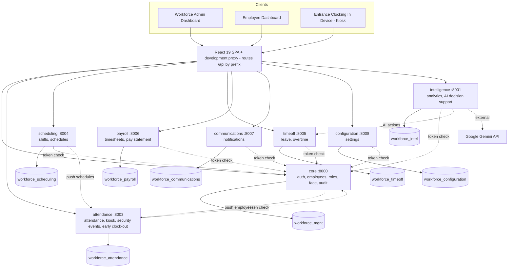

# DOCX UPDATE GUIDE — for DeepSeek

> **What this file is:** a complete specification of how the capstone document
> `GROUP 8 WORKFORCE MGT CAPSTONE DOCU.docx` must be updated so that **every
> statement in it matches the real, running system**.
> **Who reads it:** you, DeepSeek (an AI editing assistant). The human editor
> (Fercy Miano, team leader) will paste this guide and the document text to you.
> **Why it matters:** the capstone panel will read the document and then watch
> the system run. Any sentence that the system cannot back up is a defense risk.

---

## 0. HOW TO WORK WITH THIS GUIDE (read first)

1. The document is long. The human will send it to you **one chapter at a time**
   (Front matter → Ch.1 → Ch.2 → Ch.3 → Appendices). Work on the part you
   are given, using Part 4 (fact sheet) as your only source of truth about the system.
2. For each part, return **ready-to-paste text**, using exactly this format:
   ```
   ### <Section number and title>
   ACTION: KEEP | REWORD | REPLACE | ADD | REMOVE
   REASON: <one line, referencing the fact-sheet item>
   NEW TEXT:
   <full paragraph(s) — complete, not a diff>
   ```
   For sections that need no change, output only `### <section> — ACTION: KEEP`.
3. Where this guide says **DECISION NEEDED**, do not decide. Write both versions
   (A and B) and let the human choose. All such items are collected in Part 9.
4. If you need a fact that is not in Part 4, **ask the human. Never guess.**

### Hard rules
- **Never invent features, numbers, test results, dates, users, survey results, or citations.**
- **Do not change** the reference list, in-text citations, author names, the
  team-roles table, or literature-review paragraphs (Sections 2.1, 2.2.2, 2.3, 2.8.1–2.8.3),
  except where Part 5 explicitly says so. They are academic and independent of the system.
- Keep the document's voice: formal academic English, third person, Philippine
  BSIT capstone style, APA in-text citations. Keep existing heading numbers unless told otherwise.
- The document is for the **first semester: Chapters 1–3 only** (plus front matter and appendices).
  Do **not** write Chapters 4–5, test results, UAT results, or "we found that…" evaluation
  claims. Testing may be described only as *strategy* (Ch.3), or as the fact that
  automated tests exist (Part 4.12).
- Describe what exists as **implemented**. Describe anything not built as
  **"future enhancement"** or **"recommended"** — never as done.
- Do not put passwords, tokens, API keys, or personal data in the document.

---

## 1. THE DOCUMENT (structure and what is in scope)

| Part | In this semester's scope? |
|---|---|
| Title page, approval sheet, acknowledgment, dedication, abstract | Yes — small fixes |
| Table of contents, list of tables/figures/appendices | Yes — must match the body |
| Chapter 1 Introduction (1.1–1.7) | Yes — wording/scope updates |
| Chapter 2 Related Literature & Technical Background (2.1–2.8) | Yes — only the sections listed in Part 5 |
| Chapter 3 Methodology & Project Management (3.1–3.4) | Yes — **largest changes** |
| Chapter 4 (design/development/testing), Chapter 5 | **No** — intentionally not written yet |
| Appendix A (A.1–A.16) | Partially — some are empty headings; see Part 5.7 |
| References | No changes |
| Curriculum Vitae pages | No changes (images, personal data — never reproduce) |

---

## 2. THE FIVE BIGGEST PROBLEMS (fix these first)

1. **Architecture is described wrong.** The document says (3.2.1, Fig. 3.6) the
   system is a *modular monolith*: one Laravel app, one PostgreSQL database, "API
   Gateway with JWT". **Reality:** 8 independent Laravel microservices, 8 separate
   PostgreSQL databases, Sanctum tokens, no gateway service. Section 2.4.1 already
   argues *for* microservices, so 3.2.1 currently contradicts Chapter 2.
2. **User type is renamed.** "HR Manager" → **"Workforce Admin"** everywhere it
   means the system's admin user type (see Part 3).
3. **Claims about features that do not exist:** employee shift-swap /
   schedule-change requests; AI-generated or skills/availability-based schedules;
   an "AI forecasting service"; encrypted biometrics at rest; Docker, GitHub
   Actions CI/CD, PHP_CodeSniffer, Postman; Observer pattern; offline clock-in that
   syncs later; "fraud-proof" attendance (there is **no liveness detection**).
   Remove or reword per Part 5.
4. **Big real features are missing from the document:** overtime module, early
   clock-out with HR review, kiosk security (PIN, strikes, lockout, security
   events), login security (lockout, OTP reset, password policy), notifications,
   settings/languages/dark mode, audit trail, self-service pay statement, the
   data-replication design. Add per Part 6.
5. **Internal errors:** Table 2.1 says the proposed system has *No* facial
   recognition and *No* workforce analytics; table-of-contents numbering does
   not match the body; conflicting dates and sprint lengths. See Part 8.

---

## 3. GLOBAL TERMINOLOGY (apply everywhere)

| Find | Replace with | Notes |
|---|---|---|
| HR Manager / HR Managers (meaning the system user) | **Workforce Admin / Workforce Admins** | Also in tables, figure captions, sprint table, RBAC text |
| "HR Manager Dashboard" (in figures) | Workforce Admin Dashboard | |
| "HR professionals", "HR staff", "HR information systems", "HR analytics", "HR module" in **literature or general statements** | **Keep unchanged** | Only rename the *user type* |
| Entrance Clocking In Device / kiosk | Keep | Correct term |
| "modular monolith" / "single Laravel application" | "microservices architecture (8 independent services)" | See 3.2.1 |
| JWT / "JWT Auth" | Laravel Sanctum bearer tokens | |
| "API Gateway" as a component | "frontend routing layer (development proxy)" or delete | No gateway service exists |
| "fraud-proof" | "helps prevent buddy punching and time theft" | No liveness check |
| "AI-driven / AI-automated scheduling" | "automated rule-based scheduling" (+ AI *recommendations* separately) | |
| "Admin/System Administrator user type not included" (out-of-scope) | Keep, and clarify: the Workforce Admin is the HR-level admin; there is no separate IT System Administrator | |

---

## 4. SYSTEM GROUND TRUTH (single source of truth)

Everything below was verified against the source code and the live databases.

### 4.1 Identity
- Name: **AI-Enhanced Workforce Management System** (branded "WorkForce Pro" in the UI).
- Client/context: Archo Nell Incorporated (contact: Mr. Nardz Olarte, QC/QA Supervisor).
- Repository: public GitHub `fercymiano08/workforce-mgmt`, branch `main`.
- Three user types: **Workforce Admin** (HR-level administrator), **Employee**, **Entrance Clocking In Device** (kiosk — a device, not an account).
- The system runs locally (development environment). There is **no cloud deployment**.

### 4.2 Architecture — 8 microservices + 1 frontend
Each service is a separate Laravel application with its **own** PostgreSQL database.

| Service | Port | Database | Owns (writes) |
|---|---|---|---|
| `core` | 8000 | workforce_mgnt | Login/logout, Sanctum tokens, password change & OTP reset, employees, departments, roles, face registration, user profile, **audit_events** |
| `intelligence` | 8001 | workforce_intel | Analytics (6 cached sections in `analytics`), AI Decision Support, AI actions |
| `attendance` | 8003 | workforce_attendance | Attendance records, kiosk endpoints, **security_events**, **early_clock_outs** |
| `scheduling` | 8004 | workforce_scheduling | shift_definitions, shift_schedules, schedule generation |
| `timeoff` | 8005 | workforce_timeoff | leaves, overtime_requests |
| `payroll` | 8006 | workforce_payroll | timesheets, weekly generation, pay statement computation |
| `communications` | 8007 | workforce_communications | notifications |
| `configuration` | 8008 | workforce_configuration | settings (company, system/regional, kiosk config, AI resolved-insight memory) |

(Port 8002 is unused.) The React frontend (Vite dev server, port 5173) routes each `/api/...` prefix
straight to the owning service via its development proxy:
`/api/auth,employees,departments,roles,profile,audit` → core · `/api/analytics` → intelligence ·
`/api/attendance,kiosk` → attendance · `/api/shifts` → scheduling · `/api/leaves,overtime` → timeoff ·
`/api/timesheets` → payroll · `/api/notifications` → communications · `/api/settings` → configuration.
**There is no API-gateway service.**

### 4.3 How the services work together (the design the panel may ask about)
- **Authentication:** `core` issues Laravel Sanctum bearer tokens at login. Every other
  service validates a request by calling `core`'s `GET /api/auth/me` with that token and
  applying the returned role. (`core` is therefore a single point of failure for login;
  if any *other* service stops, the rest keep working.)
- **Service-to-service calls:** internal endpoints under `/api/internal/*`, protected by a
  shared secret header `X-Service-Token`. The browser never calls them.
- **Data ownership:** each table has exactly one owning service. A service that needs
  another service's data keeps a **read-only replica table**, refreshed by:
  1. **Real-time push** (best-effort, immediate) for the two categories that can block a
     kiosk action: *employees* (core → attendance, intelligence, scheduling, timeoff, payroll)
     and *shift schedules* (scheduling → attendance, intelligence).
  2. **Snapshot sync** (`php artisan snapshot:sync`) run **every minute** by Laravel's task
     scheduler (with overlap protection) in attendance, intelligence, scheduling, timeoff and payroll — the safety net for everything else.
  3. **Direct internal API calls** for actions that must happen immediately and on the owner's data
     (e.g., AI approving a leave calls timeoff; any service creating a notification calls communications; attendance triggers payroll timesheet sync).
- **Consequences to state honestly:** replicated data outside employees/schedules can be up to about
  one minute stale; cross-database foreign-key constraints do not exist — referential integrity is
  enforced by application logic; the system starts as nine local processes.
- **Migration story (usable in Ch.3/Ch.4 later):** the system was first built and verified as a
  working modular monolith (route modules per domain inside one Laravel app), then split into the
  eight services one domain at a time (Strangler-Fig style), with every service keeping its own
  automated test suite.
- **Start/stop:** `start-all.ps1` / `stop-all.ps1` (start or stop all 8 services + frontend; health-checks each service's `/up`).

### 4.4 Technology stack (with versions)
| Layer | Technology |
|---|---|
| Frontend | React 19, Vite 8, Tailwind CSS 4, React Router 7, Recharts 3, Axios, Lucide icons |
| Face recognition (in browser) | face-api.js 0.22 (tiny face detector + 68-landmark + recognition models, **self-hosted** so it works offline) |
| Backend | Laravel 13 (PHP 8.5 on the dev machine; composer requires ≥ 8.3), Laravel Sanctum |
| Database | PostgreSQL 18 — 8 databases |
| AI | Google Gemini API (model configurable, default `gemini-3.1-flash-lite`) with built-in rule-based fallback |
| Email (OTP) | SMTP (Gmail SMTP in development) |
| Testing / quality | PHPUnit (backend), ESLint + production build check (frontend) |
| Version control | Git + GitHub |
| Design | Figma (per the team; not verifiable from code) |

### 4.5 Users and permissions
- **Workforce Admin** (database role `Administrator`, label "Workforce Admin"): manage employees, register
  faces, attendance corrections, schedules, leave/overtime approval, timesheet approval, early clock-out review,
  analytics, reports, AI Decision Support, audit logs, settings, kiosk setup.
- **Employee:** own dashboard, attendance history, schedule, leave requests, overtime requests, timesheets,
  pay statement, profile, early clock-out reasons, notifications.
- **Entrance Clocking In Device:** public kiosk endpoints that return only minimal fields (name, photo,
  department, today's schedule) — never salary, email, phone or address. Exiting kiosk mode requires the admin PIN.
- Access control is enforced **on the server** (role middleware + owner checks); hiding a menu item is not the security.

### 4.6 Modules — exact behavior
**A. Time & Attendance (Kiosk)**
- Flow: employee enters Employee ID → identity confirmation card → camera → the browser computes a
  128-value face descriptor with face-api.js → the **server** compares it to the enrolled descriptor using
  **Euclidean distance, match if ≤ 0.6** → smart pre-checks → clock-in/out is recorded.
- **Face matching is server-side; only descriptor extraction is in the browser** (correct any text that says
  "verification happens locally in the browser").
- **No liveness / anti-spoofing detection.** (The API response itself reports liveness as "Not Checked".)
- Pre-checks: no shift scheduled today → clock-in refused; shift already ended → refused; duplicate clock-in warning;
  more than 15 minutes late → "will be recorded as Late" acknowledgement; more than 60 minutes early → warning;
  clocking in while on **approved leave** → blocked; approved overtime extends the allowed clock-out time.
- Security: 3 face mismatches → kiosk locks for 60 seconds; face mismatches and wrong-PIN attempts are stored as
  `security_events` (Open → Resolved) and are visible to admins and the AI module.
- Status rules (wall-clock time, timezone Asia/Manila): **Present** if clock-in ≤ shift start + 15-minute grace;
  **Late** otherwise; **Absent** if no clock-in, no approved leave, past the 60-minute absence grace.
- Hours: total = elapsed time minus the 1-hour unpaid lunch (12:00–13:00, only if the worked period overlaps it);
  overtime = time after 17:00; regular = total − overtime; standard day = 8 hours.
- Admins can add, correct and delete attendance records (every correction is audited).
- **There is no offline clock-in queue.** Face *models* work offline (self-hosted); the clock-in itself needs the backend.

**B. Early clock-out (built after the document was last edited)**
- Clocking out before shift end opens a **reason picker**: Sick, Family emergency, Personal emergency, Approved leave, Other.
  The day's status becomes "Early Leave"; an immutable `early_clock_outs` record stores minutes-early.
- Health/emergency reasons notify all Workforce Admins. Admin **classifies** each record: Pending review →
  Excused (Sick / Emergency / Early leave) or Unpaid. A Sick classification auto-drafts a pending Sick-leave request.
- Policy thresholds are configurable by the admin in Settings (defaults: window 30 days, 2 allowed early leaves,
  sick-certificate threshold 2).

**C. Shift & Schedule Management**
- Shift templates (current): **Flexible Shift 08:00–17:00** and **Overtime Shift 17:00–21:00**.
  (The old Morning / Afternoon / Night templates were removed.)
- Admin can add/edit/delete single schedules or **bulk-generate** for a date range with a chosen shift, optional
  employee or department scope, and optional weekend skipping. Generation is **rule-based**: it skips employees who already
  have a schedule that day and days covered by approved leave, notifies each employee, and flags a date to admins when
  **more than 20% of employees are on approved leave** (staffing-shortage alert).
- Schedule statuses: Scheduled, Completed, Swapped, Cancelled — set by the admin.
- **Not implemented:** employee shift-swap requests, employee schedule-change requests, skills/availability/preference optimization, AI-generated schedules.

**D. Leave Management**
- 8 leave types: Vacation, Sick, Emergency, Special, Maternity, Paternity, Bereavement, Unpaid
  (default yearly balances 20 / 10 / 5 / 5 / 105 / 7 / 5 / 30).
- Employee applies (dates, reason, optional proof file ≤ 5 MB image/PDF). Status flow: Pending → Approved / Rejected
  by the admin; the employee may cancel while Pending. Approval deducts the balance and notifies the employee.
  Approved leave prevents an "Absent" mark. Balances are shown as cards.

**E. Overtime Management (missing from the document)**
- Employee requests overtime (date, expected hours, reason); admin approves/rejects — singly or in **bulk grouped by department** —
  recording approved hours; **reconciliation** updates attendance and timesheets so payroll numbers agree;
  timesheets flag unauthorized overtime and overruns. Employee may cancel while Pending.

**F. Timesheets**
- Generated automatically per employee per week from attendance (regular, overtime, break, total hours).
  Employee submits (Draft → Submitted); admin approves/rejects. Employees get a "This Week" popup and history.

**G. Pay statement — "My Pay Record" (recent; committed)**
- Read-only, employee self-service weekly statement computed from approved timesheets:
  hourly rate = monthly salary × 12 ÷ (52 × 40); overtime premium ×1.25; **placeholder** deductions
  (SSS 150, PhilHealth 100, Pag-IBIG 50, tax 5 % of gross), all configurable, explicitly *not* statutory tables.
- The system still does **not** process payroll, payments, or real tax filing.

**H. Analytics, Dashboard & Reports**
- Workforce Admin dashboard. Analytics has 6 cached sections computed by the intelligence service:
  attendance trend, department productivity, leave trend, overtime summary, punctuality score, payroll discrepancy.
- Reports: 7 report families (attendance, department performance, leave, timesheet, overtime, shift assignments,
  employee shift summary) with filters, preview, **print** and **CSV export**.

**I. AI Decision Support**
- Reads the **last 30 days** of workforce data (attendance, pending leave/overtime, shift coverage, open security
  events). If internet and a Gemini API key exist, Gemini produces insights as strict JSON; otherwise (or on an invalid reply)
  a **deterministic rule engine** answers. Output shape: health score, insights, decision queue, and a `source` label
  ("ai" or "rule-based") that the UI shows honestly.
- One-click **actions** in the decision queue: approve/reject leave, approve/reject overtime, resolve security events;
  the module remembers resolved insights. It is a **recommendation engine with human approval**, not an automatic decision-maker.
- The AI never invents data — it only receives figures queried from the databases.

**J. Notifications, Settings, Languages**
- 22 notification types (leave request/approved/rejected/cancelled, overtime requested/approved/rejected/cancelled,
  shift assigned, schedule change, attendance reminder/late/absent/incomplete, timesheet submitted/approved/rejected/reminder,
  employee added, staff shortage, announcement, system) with priority. Bell badge, toast popups, mark read; the frontend
  **polls every 30 seconds** (no push / no Observer pattern).
- Admin Settings: company info, regional/system settings (date/time format, early-leave policy), kiosk setup
  (enable, PIN, device name, location, timezone, verification method), account (password), appearance
  (light/dark/system theme, font size), language. Employee Settings: own profile (phone, address, emergency contact, avatar), password, appearance, language.
- **5 interface languages:** English, Filipino, Japanese, Chinese (Simplified), Spanish.

**K. Audit Trail (recent; committed)**
- `core` owns an `audit_events` table (service, event, entity type/id, actor, actor id, before/after snapshot, metadata).
  Other services write to it through an internal endpoint. Admin-only **Audit Logs** page.
- Events recorded today: `employee.created / updated / deleted / face_registered`, `attendance.punch_corrected / deleted`,
  `leave.created / updated / status_changed / deleted`, `timesheet.created / updated / status_changed / deleted`,
  `early_clockout.classified / reason_updated`.
- **Not audited today:** login/logout, settings changes, shift schedules, overtime approvals, kiosk clock-ins.
  Do not claim "all user actions" are logged — say "key administrative and record-changing actions".

### 4.7 Data model (databases and tables)
- `workforce_mgnt` (core): users*, employees, departments, roles, personal_access_tokens, audit_events
- `workforce_attendance`: attendance, security_events, early_clock_outs (+ replicas)
- `workforce_scheduling`: shift_definitions, shift_schedules (+ replicas)
- `workforce_timeoff`: leaves, overtime_requests (+ replicas)
- `workforce_payroll`: timesheets (+ replicas)
- `workforce_communications`: notifications
- `workforce_configuration`: settings (one row of JSON groups: company, system, kiosk, ai_resolved_insights)
- `workforce_intel`: analytics (+ replicas of attendance, employees, leaves, overtime, security events, shifts, timesheets, settings)
- Face data: the 128-value descriptor is stored as a JSON array and the enrollment photo as a base64 image in the
  `employees` table. Passwords are bcrypt-hashed; the kiosk PIN is stored as a salted SHA-256 hash; OTP codes are stored hashed.
- Business tables total 14 logical entities plus Laravel framework tables; several services hold read-only copies.

### 4.8 Security — what is real
| Real | Not real (do not claim) |
|---|---|
| Sanctum bearer tokens; token validated for every request | JWT |
| Role-based access enforced server-side; owner checks (employees see only their own data) | A gateway performing SSL/CORS/rate limiting |
| bcrypt password hashing; password policy: ≥ 8 chars with upper-case, lower-case and a digit | Encrypted biometrics at rest / "irreversible hashing" of face vectors |
| Login lockout: 5 failed attempts → 60-second lock, per email | Liveness / anti-spoofing detection |
| Forgot-password: 6-digit OTP emailed, valid 10 minutes, one-time, hashed, throttled; employee accounts only (the admin account cannot self-reset) | Fully "fraud-proof" attendance |
| Kiosk PIN (salted SHA-256), 3-strike face lockout, security events | Rate limiting on every endpoint (only auth-reset endpoints are throttled + login lockout) |
| Server-side input validation on every write | Encryption in transit on the local dev setup (HTTPS is a deployment concern) |
| Shared-secret protection of internal service endpoints | Audit of *every* user action |
| Audit trail for key record changes (see K) | A separate Docker / cloud / CI security pipeline |

### 4.9 Testing and tooling — reality
- **123 automated PHPUnit tests** across the 8 services (core 66, intelligence 17, attendance 12, timeoff 6, scheduling 5, payroll 5, communications 5, configuration 7), all offline (in-memory SQLite), all passing at last run.
- Frontend: ESLint + production build check. Backend: Laravel logs.
- **Not present in the repository:** Dockerfile / docker-compose, GitHub Actions workflows, PHP_CodeSniffer, Postman collection.
  (Deployment files were deliberately removed earlier; deployment is planned for after completion.)
- Feature branches / pull requests: **not verifiable** — ask the human before keeping that claim (Part 9).

### 4.10 Deployment — reality
- Local development/demo environment: PostgreSQL server + 8 `php artisan serve` processes + Vite dev server, started by `start-all.ps1`.
- Cloud, containers, load balancing, message queues, monitoring dashboards: **future work**.

### 4.11 Known limitations (be honest — they make the document credible)
1. No liveness detection (a printed photo could in principle fool identity matching).
2. Face descriptors/photos are not encrypted at rest.
3. `core` is a single point of failure for authentication.
4. Replicas (other than employees and shift schedules) can lag up to ~1 minute; no cross-database foreign keys.
5. No offline clock-in queue; no shift-swap/schedule-change workflow; no skills/availability scheduling.
6. Notifications use polling (30 s), not push.
7. Pay statement uses placeholder deductions; no real payroll/tax processing.
8. No automated end-to-end (cross-service) test suite; cross-service flows were verified manually.

### 4.12 Feature status (tell the human what to commit before the defense)
- **Committed:** microservices split, kiosk, leave, overtime, timesheets, shifts (Flexible/Overtime), notifications, settings, languages, AI, analytics, reports, login security, early clock-out, replication/scheduler.
- **Also committed and pushed to GitHub (latest commit):** Audit trail (AuditLogger, audit_events, Audit Logs page), My Pay Record, and the updates to leave/attendance/timesheet pages. Everything described in this guide is now in the repository.

---

## 5. SECTION-BY-SECTION EDIT INSTRUCTIONS

### 5.1 Front matter
| Location | Problem | Action |
|---|---|---|
| Approval sheet — "Date of Final Defense: February 12, 2026" | Conflicts with "September 2026" (title page) and "August 30, 2026" (abstract) | **DECISION NEEDED** (Part 9-D). Do not guess. |
| Abstract — "HR Managers" in the description | Renamed | Replace with "Workforce Admins". Keep the rest; the abstract's recommendations ("payroll integration, cloud-based deployment…") remain valid future work. Add one sentence: the system is built as independent microservices. |
| Abstract — "The system also incorporates Employee ID verification combined with facial recognition…to ensure accurate and fraud-proof attendance tracking" | Overclaim | Reword to "helps prevent buddy punching and time theft". |
| Abstract — "automate employee shift scheduling by considering employee availability, workload distribution, and operational requirements" | Not true | Reword to "automates shift assignment through rule-based schedule generation that respects approved leave and flags staffing shortages". |
| Keywords | fine | Add "Microservices". |
| Table of contents & lists | Numbering mismatch | Part 8. |

### 5.2 Chapter 1
| Section | Action |
|---|---|
| 1.1 Background | Keep. In the paragraph "The system is being built using React…, Laravel…, Tailwind…, PostgreSQL", change "is being built" → "was built" and append "…as eight independent Laravel microservices, each with its own PostgreSQL database." Replace "AI decision support capabilities, automated rule-based shift scheduling…" wording only where it says "fraud-proof". |
| 1.2 Problem Statement | Keep, except "Scheduling Inefficiencies … absence of flexibility mechanisms such as shift swapping": keep as *problem description* (it is literature), but the solution sentence in the closing paragraph must not promise shift swapping. |
| 1.3 Vision & Scope | Rename HR Manager → Workforce Admin. **In-Scope bullets — rewrite:** (a) Role-Based User Management: three user types. (b) Time & Attendance: ID verification + face recognition; add "with kiosk security controls (PIN, failed-attempt lockout, security events) and an early clock-out reason workflow". (c) Shift & Schedule: "Automated rule-based scheduling…" — **remove** "optimizes based on employee availability, skills". (d) AI Decision Support: keep (recommendation engine). (e) Workforce Analytics: keep. (f) Timesheet Management: keep. (g) Leave Management: keep + "with proof-document upload". (h) Report Generation: keep + "print and CSV export". (i) System Accountability: reword to "an audit trail of key administrative and record-changing actions". **ADD bullets:** Overtime Management (request, approval, reconciliation); Notifications; Configurable Settings (company, regional, kiosk, appearance, five interface languages); Self-service pay statement estimate. |
| 1.3 Out-of-Scope | Change the payroll bullet to: "The system will not include automated payroll processing, statutory tax computation, or financial accounting. It provides only a simplified, read-only pay statement estimate based on approved timesheets." Keep all other bullets. Keep the "Admin/System Administrator not included" bullet and add the clarification from Part 3. |
| 1.4 Objectives | Rename. Specific objective 2: "…enables Workforce Admins to create and assign shifts (including bulk rule-based generation) and lets employees view their schedules". Remove "employees to request schedule changes". Objective 7 (integrate modules): change to "…using React, Laravel microservices, and PostgreSQL". **ADD** an objective for overtime management and one for audit/accountability. |
| 1.5 Significance | Rename roles. "For Employees": delete "structured process for requesting schedule changes"; replace with "visibility into their schedules, leave balances, overtime status and pay estimates". |
| 1.6 Terms | Rename "HR Manager" definition → **Workforce Admin** (same wording adapted). **ADD terms:** Microservice, Snapshot/Replica (read-only copy of another service's data), Audit Trail, Early Clock-Out, Overtime Reconciliation, Sanctum token. Edit *AI Automated Shift Scheduling* → mark as "AI Decision Support" and drop "AI algorithms optimize shift assignments"; keep *Automated Rule-Based Scheduling* definition but remove "skills, work hour limits" unless the human confirms. |
| 1.7 Structure | Chapter 3 description: replace "…React, Laravel, PostgreSQL, and Tailwind CSS" with the microservices stack. **Chapter 4 description conflicts with the table of contents.** Use the table-of-contents version ("System Design, Development, Testing and Evaluation") and add: "This submission covers Chapters 1 to 3; Chapters 4 and 5 will be completed in the next phase." **DECISION NEEDED** if the human prefers different wording. |

### 5.3 Chapter 2 (only the sections below change)
| Section | Action |
|---|---|
| 2.2.1 / **Table 2.1** | **Fix errors:** proposed system = **Yes** for Facial Recognition and **Yes** for Workforce Analytics. Keep the other cells. Optionally add a row "Microservice architecture": competitors "Not stated", proposed "Yes". |
| 2.2.3 Gap Analysis — *Scheduling Flexibility Gap* | Reword the solution: "addresses this gap through automated rule-based scheduling and transparent schedule visibility for employees" (remove "allows employees to request schedule changes"). |
| 2.4.1 Microservices | Replace the **last paragraph** (starts "For the proposed workforce management system, microservices architecture is particularly relevant…") with Text T-1 (Part 6). |
| 2.4.2 AI | Replace the last paragraph ("For the proposed system, AI is applied in multiple areas…") with Text T-2. |
| 2.4.3 IoT | Keep first two paragraphs. Replace the third ("Although the proposed system does not implement dedicated IoT hardware…") with Text T-3. |
| 2.4.6 Cybersecurity | Replace the last paragraph ("The proposed system implements cybersecurity controls through…") with Text T-4. Also the paragraph before it: keep, RBAC statement is true. |
| 2.4.7 Data Privacy | Keep the first three paragraphs. **Replace** the last paragraph ("The proposed system supports data privacy through…") with Text T-5. |
| 2.4.8 Quality Standards | Last paragraph: replace "Maintainability follows from the modular separation of frontend (React), backend (Laravel), and database (PostgreSQL)…" with "Maintainability follows from the separation of the React frontend from eight independently deployable Laravel services, each with its own database and automated test suite." Replace "Reliability relies on database transactions with rollback support and audit trails." with "Reliability relies on database transactions, service-level fault isolation, and an audit trail of key record changes." Replace "Performance efficiency is supported by optimized PostgreSQL queries and proper indexing" with "…supported by per-service databases, cached analytics, and proper indexing". |
| 2.4.9 Cloud | Keep; it already says "designed primarily for local or academic deployment". |
| 2.4.10 Edge | Replace the last paragraph with Text T-6 (the current text claims offline clock-in that syncs later, and local verification — both untrue). |
| 2.5 DevOps & CI/CD | **DECISION NEEDED (Part 9-A).** The 5th and 6th paragraphs (from "For the proposed AI-enhanced workforce management system, DevOps practices…" through the Docker paragraph) describe GitHub Actions, PHP_CodeSniffer, preview URLs, Docker and an "AI forecasting service" that do not exist. Provide **Version A** (rewrite as: Git/GitHub for source control; PHPUnit + ESLint + build check run by the developers; Docker/CI/CD described as a *recommended pipeline for future deployment*) and **Version B** (delete those paragraphs). Also fix "two-week sprint cycles" (see Part 8). |
| 2.6 Enterprise Architecture | Replace the 3rd and 4th paragraphs (from "The proposed AI-enhanced workforce management system follows enterprise architecture principles through its modular design…" to the end of section) with Text T-7. |
| 2.7 Conceptual Framework | Update the **Process Phase** list to include: overtime management, early clock-out review, notifications, audit trail; keep the rest. Rename roles. The framework's "Audit Logging records all user actions…" → "records key administrative and record-changing actions". Figure 2.1 must be redrawn to match (Part 7). |
| 2.8.4 Zero Trust | Replace the second paragraph ("For the proposed workforce management system, the Zero Trust paradigm guides critical security decisions…") with Text T-8 (removes encrypted-biometrics and "untrusted endpoint authenticates every transaction" claims). |
| 2.8.1 TAM | One sentence: "structured process for requesting schedule changes" → "clear visibility of schedules, leave balances and overtime status". Rename roles. |
| 2.8.2 Equity Theory | One sentence: "structured process for requesting schedule changes" → "transparent access to their schedules and hours". |
| 2.8.3 Empirical Process Control | The AI sentence ("…adapt schedule allocations and recommendations…") → "…continuously inspects recent attendance, leave, overtime and coverage data to refresh its recommendations." |

### 5.4 Chapter 3 — largest changes
| Section | Action |
|---|---|
| 3.1 Intro paragraphs | Keep. Rename roles. |
| 3.1.1 Team table | **Keep exactly.** |
| 3.1.2 Scrum events | Keep, but resolve sprint-length conflict (Part 8). Sprint table (Table 3.2): rename roles; Sprint 3 deliverable "Automated rule-based scheduling, shift creation, HR Manager approval workflows" → "Rule-based schedule generation, shift management by the Workforce Admin"; add overtime and early-clock-out to Sprints 4/5 or a new note — **DECISION NEEDED** (Part 9-F) whether to keep 7 sprints or restructure. Also fix the duplicated fragment "…Entrance Clocking In Deviceauthentication, role-based access control (RBAC) for HR Manager, Employee, and Entrance Clocking In Device" in the Sprint 1 row. |
| 3.1.3 Artifacts | Rename roles; product-backlog bullet "Audit logging for system accountability" is fine (now implemented). |
| 3.1.4 Toolstack | Replace with Text T-9 (adds microservices, face-api.js, Gemini, removes claims). |
| 3.2.1 Why Microservices? | **Replace entire section** with Text T-10. |
| 3.2.2 Core Architectural Patterns | Replace with Text T-11 (MVC, RESTful API, Service Layer, Active Record/ORM, **API-driven microservices with database-per-service, data replication, internal service calls**). Delete "Repository Pattern" and "Observer Pattern" (neither exists). |
| Figure 3.6 | Redraw — spec in Part 7. Caption: "Figure 3.6: Microservices System Architecture". |
| 3.3.1 DevOps Toolchain | **DECISION NEEDED (Part 9-A)** — items 3 (GitHub Actions) and part of 1 (GitHub Projects/Issues, labels, milestones) and 2 (feature branches) are unverified. Provide Version A/B. Item 4 (Postman): unverified. Item 5 (Monitoring: Laravel logging) is true; also mention the health-check endpoint `/up` and startup health check. |
| 3.3.2 CI/CD Pipeline + Fig 3.7/3.8 | **DECISION NEEDED (Part 9-A).** Version A: retitle "3.3.2 Recommended CI/CD Pipeline (Future Deployment)" and change all verbs to conditional/future; Version B: delete. The two figures 3.7 and 3.8 are duplicates with the same caption "Simplified CI/CD Pipeline" — keep only one either way. |
| 3.3.3 Testing Strategy | Keep four levels, but: *Unit/Feature testing* — say PHPUnit feature and unit tests run **per service** (8 suites, 123 tests) and are executed locally by developers (remove "automated through GitHub Actions on every pull request" unless the human confirms CI exists). *API testing* — Postman: **DECISION NEEDED**; alternative true wording: endpoints are exercised through PHPUnit HTTP tests and manual requests. Manual and UAT paragraphs: keep (strategy only). Add: cross-service flows verified manually; automated cross-service tests are future work. |
| 3.4 Innovation Framework | Keep the five phases. Stage 2 "employee self-service schedule change requests" → remove. Stage 3 "Schedule management features based on industry best practices" keep. |
| 3.4.1 Realized Innovations | Rewrite items 1–4 with Text T-12 and add items 5–7 (overtime reconciliation, early clock-out workflow, replicated microservice data design). Remove "eliminates buddy punching" absolutes. |

### 5.5 Appendix A
| Item | Action |
|---|---|
| A.1 System Architecture | Currently an empty heading. Write 2–3 paragraphs + the architecture table from Part 4.2 and the redrawn figure. |
| A.2 Information Systems Integration | Write from Part 4.3 (auth via core, internal endpoints, replicas, push, scheduler). |
| A.4 Database Schema | Write from Part 4.7 (8 databases and their tables). Mention the project file "database schema microservices structure.sql" as the schema reference. |
| A.5 Network Configuration | Local: ports 8000–8008, 5173, 5432; internal calls over HTTP on localhost with shared secret. |
| A.6 Deployment and Infrastructure | Reality: local start-up via `start-all.ps1`; cloud/container deployment = future work. |
| A.7 Security Measures + Figure A.7.1 | Rewrite text using Part 4.8 table (left column only) and Text T-13; redraw the figure without "API Gateway (SSL, CORS, Rate Limiting)" and without "Encrypted Biometrics"; fix the `&amp;` rendering bug in the current figure. |
| A.8 Testing | Keep the layered strategy, but state actual counts (123 PHPUnit tests, 8 suites). |
| A.9, A.10, A.14 | Empty headings — A.10 APIs and Integration Points: write a table of API prefixes → service (Part 4.2) and the internal endpoints concept. A.14 DevOps/CI/CD: follow the Part 9-A decision. A.9 Monitoring: `/up` health endpoints, Laravel logs. |
| A.11 User Documentation | Keep; add that the project folder contains a beginner guide, workflow guide, defense Q&A, database tutorial and startup guide. |
| A.12 Known Issues | **Replace** the listed "known issues" (low-light, slow report generation, session timeouts, duplicate entries…) with the *verified* limitations in Part 4.11, plus the true operational ones: no liveness detection; first face-model load is slower; services must be started together. |
| A.13 Version Control | Repository URL is correct. Replace the "three main directories: backend (Laravel REST API), frontend, project full document" sentence with: root contains `backend/` (8 microservice folders + `_templates/` scaffolding), `frontend/`, `project full document/`, and `start-all.ps1` / `stop-all.ps1`. Keep the feature-branch sentence only if the human confirms (Part 9-B). |
| A.15 Licensing | Keep. |
| A.16 Performance Metrics | It claims "automated alerts notify administrators when metrics fall outside thresholds" — **not implemented.** Reword: metrics that can be observed today (service health `/up`, response times, error logs); automated alerting = future work. |

---

## 6. READY-TO-PASTE REPLACEMENT TEXTS

**T-1 — Section 2.4.1, last paragraph**
> For the proposed workforce management system, microservices architecture is directly applicable because the platform contains several independent business capabilities. The system is implemented as eight independent Laravel services: an identity and employee service (core), an attendance and kiosk service, a scheduling service, a time-off service for leave and overtime, a payroll service for timesheets and pay statements, a communications service for notifications, a configuration service for system settings, and an intelligence service for analytics and AI decision support. Each service runs as its own process and owns its own PostgreSQL database, so a slowdown or failure in one capability, such as analytics, does not stop employees from clocking in or managers from approving leave. Services communicate through REST calls, and data that one service needs from another is kept as a read-only replica that is refreshed automatically. The trade-offs of this style, namely additional operational complexity and eventually consistent replicated data, were accepted in exchange for fault isolation and independent development and testing.

**T-2 — Section 2.4.2, last paragraph**
> For the proposed system, AI is applied in two areas. First, facial recognition supports attendance verification: a face-recognition model running in the employee's browser converts the camera image into a numerical face descriptor, which the server compares with the descriptor enrolled by the Workforce Admin. Second, an AI Decision Support module analyzes the most recent thirty days of attendance, leave, overtime, shift coverage and security-event data and presents recommendations to the Workforce Admin. The module uses the Google Gemini language model when an internet connection and API key are available and automatically falls back to a built-in rule-based engine otherwise, so the feature remains available offline. Shift assignments themselves are generated by an automated rule-based scheduler, not by AI. All AI output is advisory: the Workforce Admin must approve any resulting action, keeping a human in the decision loop.

**T-3 — Section 2.4.3, third paragraph**
> Although the proposed system does not implement dedicated IoT hardware, the concept informs the design of the Entrance Clocking In Device. The kiosk is a web page running on an ordinary tablet or computer with a camera; it captures the employee's identity claim and face image and sends the resulting data to the attendance service. Because the device is a public endpoint, the system limits what it can do: the kiosk endpoints return only minimal employee information, the exit from kiosk mode requires an administrator PIN, repeated failed face matches lock the kiosk for sixty seconds, and each failed attempt is recorded as a security event for administrator review.

**T-4 — Section 2.4.6, last paragraph**
> The proposed system implements the following cybersecurity controls. Users authenticate through Laravel Sanctum bearer tokens, which the identity service issues and every other service verifies for each request. Passwords are hashed with bcrypt and must meet a minimum policy of eight characters including upper-case, lower-case and numeric characters. Repeated failed logins trigger a temporary lockout, and password recovery uses a one-time six-digit code that expires after ten minutes and is stored only in hashed form. Role-based access control and per-record ownership checks are enforced on the server for every protected endpoint, all write requests are validated on the server, and communication between services uses a shared secret so that internal endpoints cannot be called from outside. An audit trail records key administrative and record-changing actions. Protection measures such as HTTPS, database encryption at rest and liveness detection are documented as recommended enhancements for production deployment.

**T-5 — Section 2.4.7, last paragraph**
> The proposed system supports data privacy through role-based access control, user authentication, an audit trail of key record changes, and limited data collection. Employees can view only their own records, and the entrance kiosk can access only minimal identification fields. Facial data consists of a numerical face descriptor and an enrollment photograph stored in the employee record; access to it is restricted to authenticated administrators, and it is used only for attendance verification. The audit trail records who changed an employee, attendance, leave or timesheet record and when. Because facial data is sensitive under the Data Privacy Act, encryption of stored biometric data, explicit consent forms and a retention policy are identified as necessary enhancements before real-world deployment. The AI decision support module follows the principle of data minimization by using only operational data such as attendance, schedules, leave, overtime and timesheet records.

**T-6 — Section 2.4.10, last paragraph**
> For the proposed system, edge processing is relevant to the Entrance Clocking In Device. The face-recognition models are hosted locally with the application and run in the kiosk's browser, so the face image is converted to a numerical descriptor on the device and the photograph itself does not need to be sent for matching; only the descriptor is transmitted to the attendance service, which performs the comparison. This reduces bandwidth and keeps the models usable without internet access. The current implementation requires the backend to be reachable to record a clock-in; queuing attendance events for later synchronization during network outages is identified as a future enhancement.

**T-7 — Section 2.6, last two paragraphs**
> The proposed system applies these principles through a service-oriented design. The React frontend, eight Laravel services and their PostgreSQL databases form distinct architectural layers with clearly defined responsibilities: the frontend handles interaction, each service owns one business capability and its data, and communication occurs through RESTful APIs. Each service exposes its public API to the frontend and a separate set of internal endpoints, protected by a shared secret, for service-to-service calls. This separation lets each service be developed, tested and restarted independently, and schema changes are managed per service through Laravel migrations.
>
> API-based integration is central to the architecture. The frontend routes every request to the service that owns the relevant data. Where a service needs another service's data, the design uses read-only replicas kept current by immediate push updates for critical reference data (employees and shift schedules) and by a scheduled synchronization every minute for everything else, while actions that must occur on the owner's data, such as approving a leave request from the AI decision queue, are performed through internal API calls to the owning service. Laravel Sanctum tokens issued by the identity service are verified by every other service, so access rules remain consistent across service boundaries.

**T-8 — Section 2.8.4, second paragraph**
> For the proposed workforce management system, the Zero Trust paradigm guides several security decisions. Every request to a protected endpoint must carry a valid Sanctum token, which each service verifies with the identity service rather than trusting the caller. Role-based access control applies least privilege, so Workforce Admins and Employees reach only the data and functions assigned to them, and employees can read only their own records. Internal service endpoints require a shared secret and are not exposed to the frontend. The Entrance Clocking In Device is treated as a public, limited-capability endpoint: it returns minimal data, requires a PIN to leave kiosk mode, and locks after repeated failed face matches. An audit trail records key administrative changes to support investigation. Together these controls move the system toward Zero Trust principles; encryption of stored biometric data and HTTPS are recommended additions for production deployment in compliance with the Data Privacy Act of 2012 (Republic Act No. 10173).

**T-9 — Section 3.1.4 Toolstack (replace bullets)**
> - **Frontend Development:** React 19 with Vite builds the user interface (role-based dashboards, forms, tables, the kiosk terminal); Tailwind CSS 4 provides responsive styling; Recharts renders analytics charts; the browser-based face-api.js library performs face detection and descriptor extraction with self-hosted models so it also works offline.
> - **Backend Development:** Laravel 13 (PHP) is used to build eight independent REST API services (core, intelligence, attendance, scheduling, time-off, payroll, communications and configuration), each responsible for one business capability.
> - **Database:** PostgreSQL 18 hosts one database per service. Read-only replica tables and internal APIs share data between services.
> - **Authentication:** Laravel Sanctum bearer tokens issued by the core service and verified by every other service, with role-based access control for the Workforce Admin, Employee and Entrance Clocking In Device.
> - **Artificial Intelligence:** Google Gemini for natural-language workforce insights with a built-in rule-based fallback.
> - **Version Control:** Git and GitHub. *(Keep the feature-branch / pull-request sentence only if confirmed — Part 9-B.)*
> - **Design and Prototyping:** Figma. *(keep if the team used it)*
> - **Testing:** PHPUnit for each service's automated tests, ESLint and a production build check for the frontend, plus manual testing. *(Add "Postman" only if confirmed — Part 9-A.)*
> - **Collaboration and Communication:** *(keep the existing Discord/Messenger/face-to-face text unchanged)*

**T-10 — Section 3.2.1 "Why Microservices? Justify the Choice Over Monolithic Architecture" (replace all four paragraphs)**
> The proposed AI-enhanced workforce management system adopts a microservices architecture in which each major business capability runs as an independent Laravel service with its own PostgreSQL database. The system was first built and verified as a modular monolith, in which each domain was already a separate route module owning its own tables, and was then separated into eight services one domain at a time. Extracting a domain only after its boundaries were proven inside the working application allowed each step to be verified by automated tests before the next began.
>
> A purely monolithic design has limitations for a workforce management platform. A surge of face-verification requests at shift change would compete for the same server resources as scheduling and timesheet processing, and an unhandled exception or slow analytics query in one module could degrade or crash the entire application. Schema changes in a single shared database would also affect every module at once.
>
> The chosen architecture addresses these concerns in four ways. First, *fault isolation*: if the analytics and AI service is stopped, employees can still clock in, leave can still be approved and timesheets are still generated, because those functions belong to other services. Second, *independent scaling and testing*: the attendance service, which receives the most concurrent traffic, can be scaled or restarted without affecting reporting, and each of the eight services has its own automated test suite. Third, *clear data ownership*: each table is written by exactly one service, and other services hold read-only copies, which prevents accidental cross-module coupling. Fourth, *independent evolution*: a service's schema and code can change without redeploying the others.
>
> The design also has costs that the team accepted. The system consists of nine cooperating processes instead of one, so a start-up script and health checks are required. Replicated data is eventually consistent; therefore employee data and shift schedules, which affect kiosk clock-in, are pushed to dependent services immediately when they change, while other replicated data is refreshed every minute. Cross-database foreign keys are not possible, so referential integrity is enforced by application logic. Finally, because every service validates tokens with the identity service, that service is a single point of failure for sign-in. The overall architecture is illustrated in Figure 3.6.

**T-11 — Section 3.2.2 Core Architectural Patterns (replace list)**
> - **Model-View-Controller (MVC):** each Laravel service organizes its logic into models (Eloquent ORM), controllers (request handling) and JSON responses consumed by the React frontend.
> - **RESTful API:** every service exposes resource-based endpoints (employees, attendance, shifts, leaves, overtime, timesheets, notifications, settings, analytics).
> - **Microservices with Database-per-Service:** each capability owns its data; no service reads another service's database directly.
> - **Data Replication and Snapshot Synchronization:** services keep read-only replicas of reference data they need, refreshed by immediate push for critical data and by scheduled synchronization for the rest.
> - **Service Layer:** business rules such as timesheet generation, overtime reconciliation, early-leave policy, pay computation, analytics and AI recommendations are encapsulated in dedicated service classes.
> - **Active Record (Eloquent ORM):** models map directly to tables and abstract raw SQL.
> - **API Client Pattern:** small client classes (for example a notification client or an audit client) wrap calls to other services and isolate failures.

**T-12 — Section 3.4.1 Realized System Innovations (replace items 1–4, add 5–7)**
> 1. **Employee ID and Facial Recognition Verification:** the kiosk combines an Employee ID with face verification. The face descriptor is computed in the browser and matched on the server, which helps prevent buddy punching and time theft; failed attempts are limited by a lockout and logged as security events.
> 2. **AI Decision Support:** analyzes recent workforce data, identifies attendance patterns and coverage gaps, and provides recommendations with one-click approval actions, using Gemini when available and a rule-based engine otherwise.
> 3. **Automated Rule-Based Scheduling:** schedules can be generated for a date range, shift and department in one action; the generator skips existing schedules and approved-leave days and warns of possible staffing shortages.
> 4. **Analytics and Reports:** cached analytics sections and seven report types with print and CSV export support data-driven decisions.
> 5. **Overtime Reconciliation:** approved overtime is propagated to attendance and timesheets so hours agree across modules.
> 6. **Early Clock-Out Workflow:** employees state a reason when leaving early; administrators classify it as excused or unpaid, and sick reasons draft a leave request automatically.
> 7. **Replicated Microservice Data Design:** independent services stay consistent through immediate push updates for critical data and scheduled synchronization for the rest.

**T-13 — Appendix A.7, opening paragraph**
> This appendix presents the security architecture of the AI-Enhanced Workforce Management System. Requests are authenticated with Sanctum tokens verified by the identity service, authorized by role and record ownership, validated on the server, and, for key record changes, written to an audit trail. Internal service endpoints are protected by a shared secret. Additional controls, namely HTTPS, encryption of stored biometric data, liveness detection and automated alerting, are recommended for production deployment in line with the Philippine Data Privacy Act of 2012 (RA 10173).

---

## 7. FIGURES TO REDRAW OR FIX

| Figure | Problem | What it must show |
|---|---|---|
| **3.6 System Architecture** | Shows monolith, "API Gateway + JWT", one DB | See diagram below |
| **2.1 Conceptual Framework** | Process phase outdated | Update the Process phase (Part 5.3, 2.7) |
| **A.7.1 Layered Security** | "API Gateway Security (SSL, CORS, Rate Limiting)", "Encrypted Biometrics", `&amp;` rendering bug | Layers: Sanctum authentication → role & ownership authorization → server validation → hashed credentials → audit trail → data-privacy compliance (RA 10173) |
| **3.7 / 3.8 CI/CD** | Two identical figures; pipeline not implemented | Part 9-A |
| A.8.1, A.13.1, A.15.1, A.16.1 | Not reviewed | Human should check each still matches the final text |

**Figure 3.6 specification**

Legend to add: solid = user request; dashed = service-to-service (token check, replica push, internal API); each database belongs to exactly one service; read-only replicas not drawn.

---

## 8. DOCUMENT-INTERNAL ERRORS (independent of the system)

1. **Table 2.1** — proposed system column: Facial Recognition "No" → **Yes**; Workforce Analytics "No" → **Yes**.
2. **Table of contents vs body — Section 2.4:** the body has 2.4.1 Microservices, 2.4.2 AI, 2.4.3 IoT, 2.4.4 Data Analytics, 2.4.5 Polyglot Persistence, 2.4.6 Cybersecurity, 2.4.7 Data Privacy, 2.4.8 Software Quality, 2.4.9 Cloud, 2.4.10 Edge. The table of contents lists only six with different numbers. Make the table of contents match the body. (The human should regenerate it in Word: References → Update Table.)
3. **Chapter 4 title/description** differs between the table of contents ("System Design, Development, …") and Section 1.7 ("Testing and Evaluation") — align to the table of contents (Part 5.2).
4. **Dates:** approval sheet "February 12, 2026", title page "September 2026", abstract "Date of Completion: August 30, 2026" — **DECISION NEEDED** (Part 9-D).
5. **Sprint length:** Section 3.1.2 says one-week sprints and a seven-week plan; Section 2.5 says "two-week sprint cycles" — make consistent (Part 9-F).
6. **Sprint 1 row** of Table 3.2 contains a duplicated phrase ("…Entrance Clocking In Deviceauthentication, role-based access control…") — delete the repeated half.
7. **Figure 3.7 and 3.8** are the same figure with the same caption.
8. **List of Tables / List of Figures** page numbers and titles: figure list shows "Conceptual Framework 92, System Architecture 93, CI/CD 93" while the body numbers are 2.1, 3.6, 3.7/3.8 — regenerate/correct.
9. **Section 2.2.1** text says facial recognition of the proposed system is compared to competitors' "limited" capability, consistent with the corrected table.
10. **Statement in 3.2.2 that Eloquent "implements the repository pattern"** is technically wrong (Eloquent is Active Record) — covered by T-11.
11. **Figure A.7.1** shows a literal `&amp;`.

---

## 9. DECISIONS THE HUMAN MUST MAKE (write both versions, do not choose)

| ID | Question | Recommended default |
|---|---|---|
| **9-A** | The document describes Docker, GitHub Actions CI/CD, PHP_CodeSniffer, Postman and preview URLs. None exist in the repository. Keep as *recommended future pipeline* (Version A) or delete (Version B)? Does the team have any of these outside the repo (e.g., a private Postman collection)? | Version A, only for CI/CD/Docker; delete PHP_CodeSniffer and preview URLs; keep Postman only if the team truly used it. |
| **9-B** | Did the team really use feature branches and pull-request reviews? (`git` history appears to be on `main`.) | If not confirmed, reword to "Git and GitHub were used for version control and collaboration." |
| **9-C** | RESOLVED: Audit trail and My Pay Record are now committed and pushed. | Describe them as implemented. |
| **9-D** | Which dates are correct: final-defense date, title-page month, completion date? | Human decides. |
| **9-E** | Keep the "Innovation / Design Thinking" stages 1 and 5 (interviews and prototype evaluation with Mr. Olarte)? They cannot be verified from the system. | Keep only if the team truly did them. |
| **9-F** | Sprint plan: keep the 7-week/one-week-sprint table or restructure to show that overtime, early clock-out, microservices and audit were added later? | Add a short note under Table 3.2 stating the microservices migration and later enhancements were delivered in additional iterations. |
| **9-G** | Should Section 1.3 list "self-service pay statement estimate" as in-scope, or omit it because it edges toward the out-of-scope payroll statement? | Include it, with the exact disclaimer in Part 5.2 (out-of-scope bullet). |

---

## 10. PANEL-CONSISTENCY CHECKLIST (verify before the human submits)

For each sentence a panelist could test, the system can demonstrate it:

| Document claim | Where it can be shown in the running system |
|---|---|
| 8 independent services, own databases | `start-all.ps1` health check; stop one service (e.g., intelligence) and show attendance/leave still work; PostgreSQL shows 8 databases |
| Face + ID clock-in | `/kiosk` page |
| Lockout after failed attempts | Kiosk: 3 wrong faces; Login: 5 wrong passwords |
| Early clock-out reason + HR review | Kiosk clock-out before 17:00 → Attendance page → Early Clock Outs tab |
| Rule-based schedule generation with leave skipping and shortage alert | Workforce Admin → Shifts → Generate |
| Leave / overtime / timesheet approval flows | Employee submits → Admin approves → notification appears |
| AI Decision Support with source label | Workforce Admin → AI Decision Support (badge shows Gemini or rule-based) |
| Analytics / reports / CSV / print | Analytics and Reports pages |
| Audit trail | Workforce Admin → Audit Logs (after editing an employee) |
| Roles: Workforce Admin, Employee, kiosk | Login as each |
| 123 automated tests | `php artisan test` in each `backend/<service>` folder |
| Documented limitations | Part 4.11 |

---

## 11. FINAL OUTPUT REQUEST

When all parts are processed, return in this order:
1. A **change log table**: Section | Action | One-line reason.
2. The **final text of every changed section** (using the format in Part 0).
3. A **list of every remaining DECISION NEEDED** item with your recommended answer.
4. A **list of any statement you could not verify against Part 4**, so the human can check it.

*End of guide.*
